# StorySlider Framework

> 一個互動式簡報框架，結合動畫角色與對話系統，打造沉浸式簡報體驗。

**作者**: Brian  
**版本**: 0.0.0  
**授權**: Private

---

## 1. 簡介與目標

### 1.1 系統概述

StorySlider 是一個基於 React + TypeScript 的互動式簡報框架，專為需要角色導覽與對話互動的簡報場景設計。

### 1.2 核心目標

- 提供流暢的投影片切換動畫體驗
- 整合動態角色系統，隨投影片轉場移動
- 實現打字機效果的對話框系統
- 支援多種投影片類型（圖片/文字/HTML）
- 一鍵部署至 GitHub Pages

### 1.3 主要利害關係人

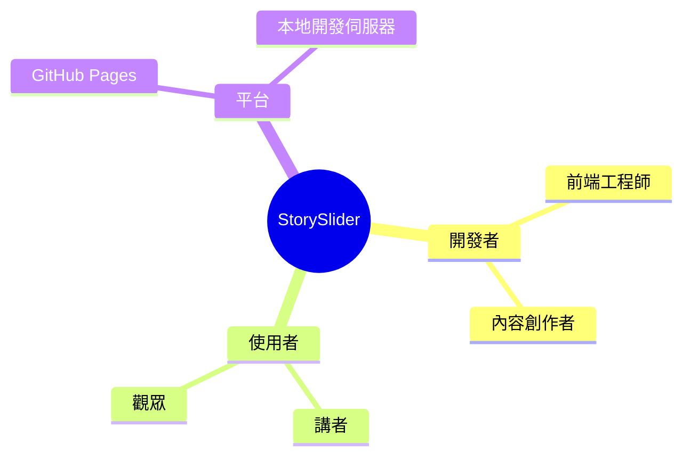

---

## 2. 架構限制

### 2.1 技術限制

- **前端框架**: React 19.x + TypeScript
- **建構工具**: Vite 6.x
- **樣式方案**: TailwindCSS (CDN)
- **圖示庫**: Lucide React
- **部署目標**: 靜態網頁 (GitHub Pages)

### 2.2 組織限制

- 單頁應用程式 (SPA) 架構
- 無後端服務依賴
- 靜態資源管理

---

## 3. 系統範圍與上下文

### 3.1 業務上下文

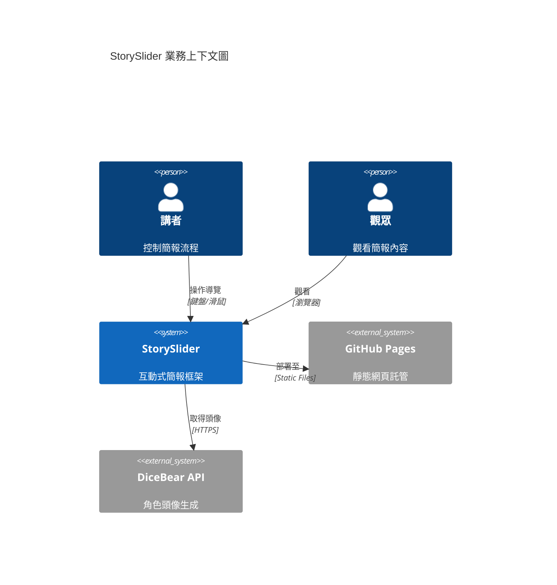

### 3.2 技術上下文

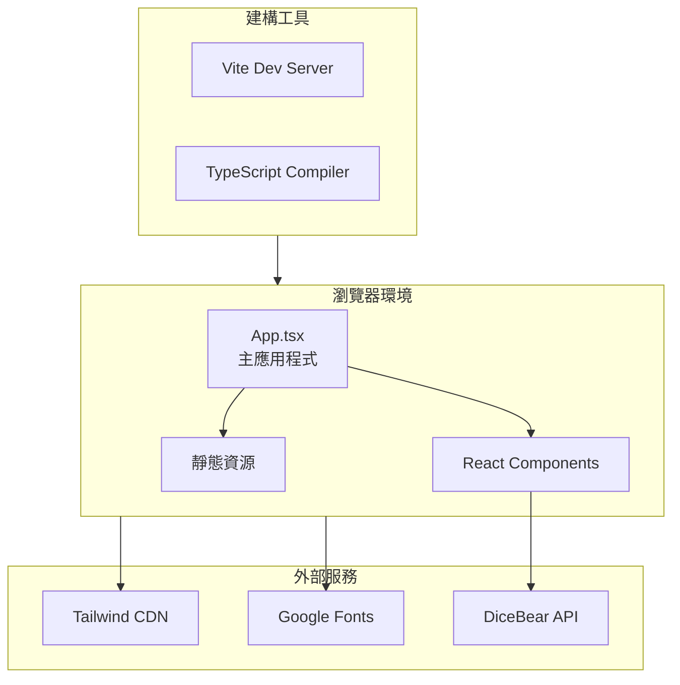

---

## 4. 解決方案策略

### 4.1 技術決策

| 決策項目 | 選擇方案 | 理由 |
|---------|---------|------|
| UI 框架 | React 19 | 最新穩定版，支援 Concurrent Features |
| 型別系統 | TypeScript | 強型別確保程式碼品質 |
| 建構工具 | Vite | 快速 HMR，現代化 ESM 支援 |
| 樣式方案 | TailwindCSS | 快速原型開發，實用優先 |
| 動畫 | CSS Animations | 輕量、高效能 |

### 4.2 核心策略

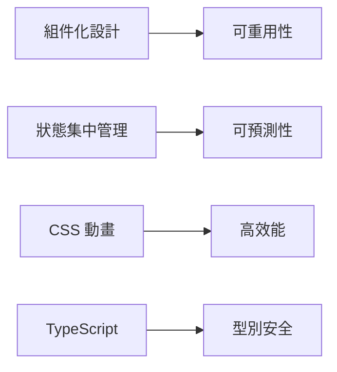

---

## 5. 建構區塊視圖

### 5.1 層級結構

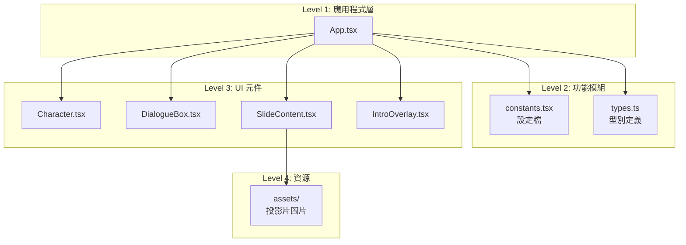

### 5.2 目錄結構

```
ViberIsNotCoder/
├── index.html            # HTML 進入點
├── index.tsx             # React 進入點
├── App.tsx               # 主應用程式元件
├── constants.tsx         # 應用程式設定
├── types.ts              # TypeScript 型別定義
├── vite.config.ts        # Vite 設定
├── package.json          # 專案依賴
├── components/           # React 元件
│   ├── Character.tsx     # 角色元件
│   ├── DialogueBox.tsx   # 對話框元件
│   ├── IntroOverlay.tsx  # 開場動畫元件
│   └── SlideContent.tsx  # 投影片內容元件
└── assets/               # 靜態資源
    └── slide-*.png       # 投影片圖片
```

---

## 6. 執行時期視圖

### 6.1 應用程式啟動流程

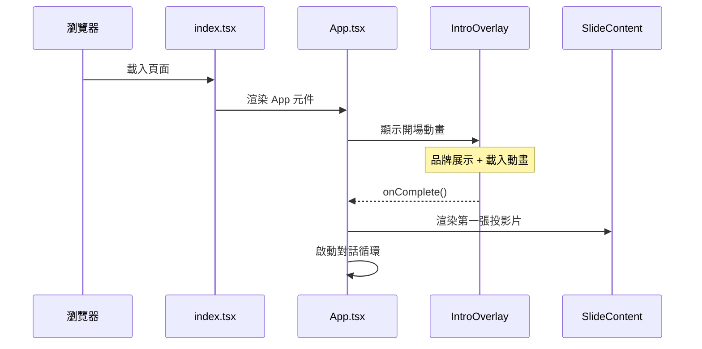

### 6.2 投影片切換流程

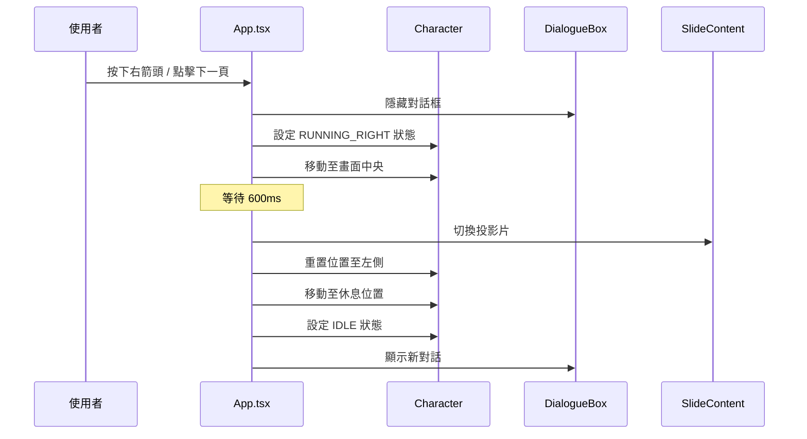

### 6.3 對話循環流程

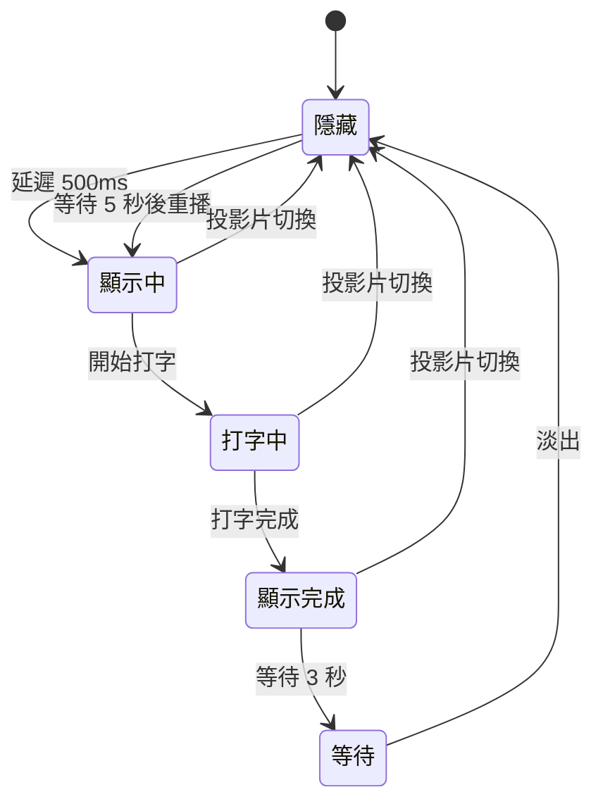

---

## 7. 部署視圖

### 7.1 部署架構

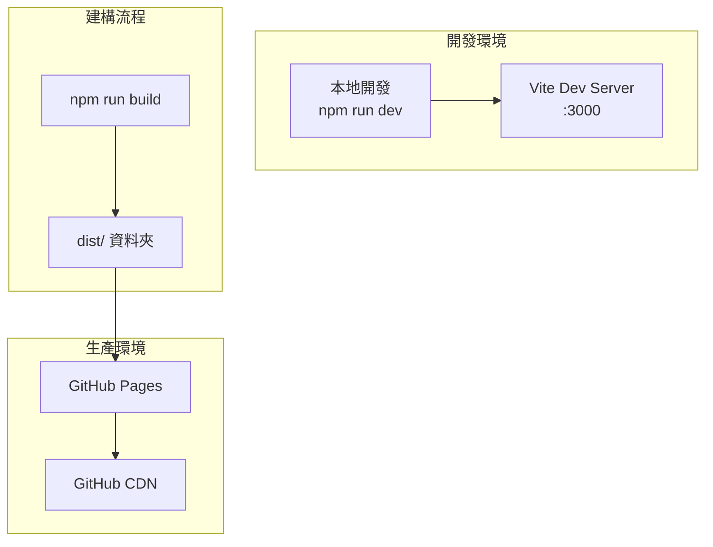

### 7.2 本地開發部署

#### 前置需求

- Node.js >= 18.x
- npm >= 9.x

#### 步驟

```bash
# 1. 複製專案
git clone https://github.com/your-username/ViberIsNotCoder.git
cd ViberIsNotCoder

# 2. 安裝依賴
npm install

# 3. 啟動開發伺服器
npm run dev
```

- 開發伺服器執行於: `http://localhost:3000`

### 7.3 GitHub Pages 部署

#### 方法一：手動部署

```bash
# 1. 建構生產版本
npm run build

# 2. 預覽建構結果
npm run preview

# 3. 將 dist/ 資料夾推送至 gh-pages 分支
```

#### 方法二：GitHub Actions 自動部署

建立 `.github/workflows/deploy.yml`:

```yaml
name: Deploy to GitHub Pages

on:
  push:
    branches: [ main ]

permissions:
  contents: read
  pages: write
  id-token: write

jobs:
  build:
    runs-on: ubuntu-latest
    steps:
      - uses: actions/checkout@v4
      
      - name: Setup Node.js
        uses: actions/setup-node@v4
        with:
          node-version: '20'
          cache: 'npm'
      
      - name: Install dependencies
        run: npm ci
      
      - name: Build
        run: npm run build
      
      - name: Setup Pages
        uses: actions/configure-pages@v4
      
      - name: Upload artifact
        uses: actions/upload-pages-artifact@v3
        with:
          path: './dist'

  deploy:
    environment:
      name: github-pages
      url: ${{ steps.deployment.outputs.page_url }}
    runs-on: ubuntu-latest
    needs: build
    steps:
      - name: Deploy to GitHub Pages
        id: deployment
        uses: actions/deploy-pages@v4
```

#### 設定 Vite Base Path

修改 `vite.config.ts` 以支援 GitHub Pages:

```typescript
export default defineConfig(({ mode }) => {
    // ... existing code ...
    return {
      base: '/ViberIsNotCoder/', // 替換為您的儲存庫名稱
      // ... rest of config ...
    };
});
```

#### 啟用 GitHub Pages

1. 前往 GitHub 儲存庫 → Settings → Pages
2. Source: 選擇 "GitHub Actions"
3. 推送程式碼至 main 分支觸發部署

---

## 8. 交叉切面概念

### 8.1 狀態管理

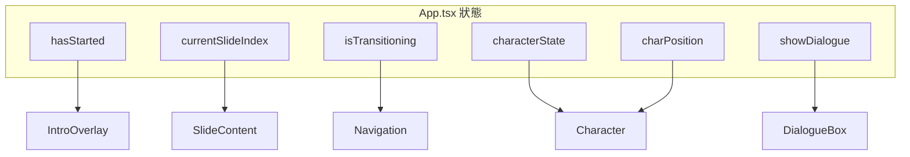

### 8.2 動畫系統

| 動畫名稱 | 用途 | 實作方式 |
|---------|------|---------|
| `float` | 角色閒置浮動 | CSS Keyframes |
| `run` | 角色奔跑 | CSS Keyframes |
| `blink` | 打字游標閃爍 | CSS Keyframes |
| `fadeIn` | 投影片淡入 | Tailwind Animation |
| 位置過渡 | 角色移動 | CSS Transition |

### 8.3 元件介面

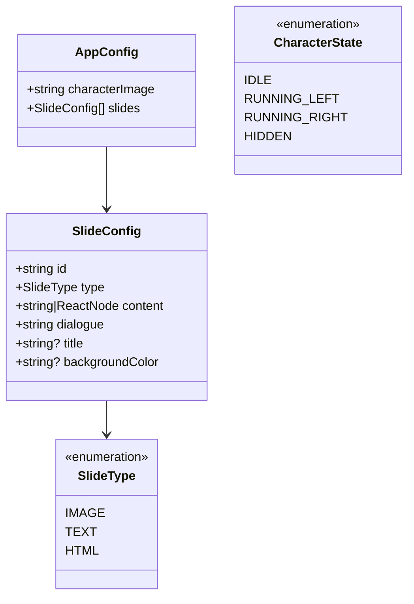

---

## 9. 架構決策

### 9.1 ADR-001: 選擇 React 作為 UI 框架

- **狀態**: 已採用
- **決策**: 使用 React 19 搭配 TypeScript
- **理由**:
  - 成熟的生態系統
  - 豐富的元件化能力
  - 強大的狀態管理

### 9.2 ADR-002: 使用 CSS 動畫而非 JavaScript 動畫庫

- **狀態**: 已採用
- **決策**: 使用純 CSS Keyframes 與 Transitions
- **理由**:
  - 更佳的效能 (GPU 加速)
  - 減少 bundle 大小
  - 簡化依賴管理

### 9.3 ADR-003: 集中式設定管理

- **狀態**: 已採用
- **決策**: 將所有投影片與角色設定集中於 `constants.tsx`
- **理由**:
  - 便於內容管理
  - 分離關注點
  - 支援快速修改

---

## 10. 品質需求

### 10.1 品質樹

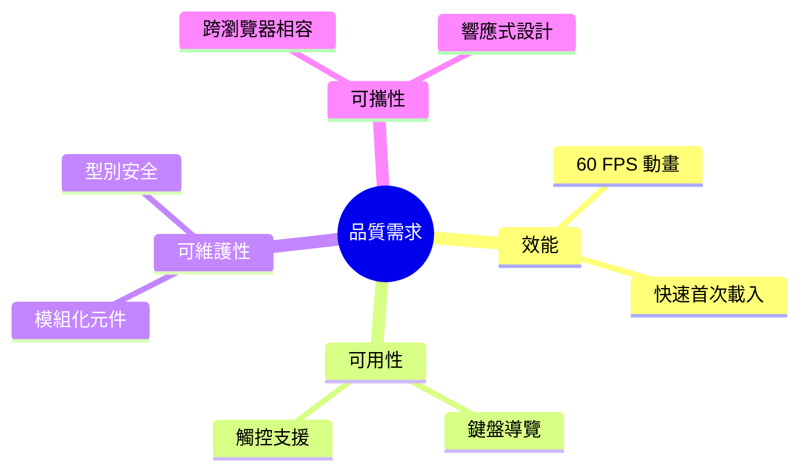

### 10.2 品質場景

| 品質屬性 | 場景 | 度量 |
|---------|------|------|
| 效能 | 投影片切換動畫流暢度 | 維持 60 FPS |
| 效能 | 首次載入時間 | < 3 秒 (3G 網路) |
| 可用性 | 鍵盤操作 | 左右箭頭鍵導覽 |
| 可維護性 | 新增投影片 | 僅需修改 constants.tsx |

---

## 11. 技術風險與債務

### 11.1 已識別風險

| 風險 | 影響 | 緩解措施 |
|-----|------|---------|
| TailwindCSS CDN 載入失敗 | 樣式消失 | 考慮本地建構 |
| DiceBear API 不可用 | 角色頭像無法顯示 | 使用本地備援圖片 |
| 大型圖片資源 | 載入緩慢 | 圖片壓縮/懶載入 |

### 11.2 技術債務

- [ ] 缺少單元測試
- [ ] 缺少 E2E 測試
- [ ] 圖片未做壓縮優化
- [ ] 未實作 Service Worker 離線支援

---

## 12. 詞彙表

| 術語 | 定義 |
|-----|------|
| 投影片 (Slide) | 單一頁面的簡報內容 |
| 角色 (Character) | 畫面中的動畫導覽角色 |
| 對話框 (DialogueBox) | 顯示角色台詞的 UI 元件 |
| 轉場 (Transition) | 投影片之間的切換動畫 |
| 開場動畫 (Intro Overlay) | 應用程式啟動時的品牌展示 |

---

## 附錄

### A. 快速開始

```bash
# 開發模式
npm run dev

# 建構生產版本
npm run build

# 預覽生產版本
npm run preview
```

### B. 新增投影片

編輯 `constants.tsx`:

```typescript
slides: [
  // ... existing slides ...
  {
    id: 'slide-new',
    type: SlideType.IMAGE,
    content: 'assets/new-slide.png',
    dialogue: "這是新投影片的對話內容",
  },
]
```

### C. 操作說明

| 操作 | 動作 |
|-----|------|
| `→` 右箭頭 | 下一張投影片 |
| `←` 左箭頭 | 上一張投影片 |
| 點擊角色 | 重播對話 |
| 點擊導覽按鈕 | 切換投影片 |

---

<p align="center">
  <sub>Built with ❤️ by Brian</sub>
</p>
